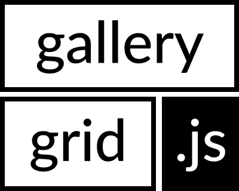

# GalleryGrid.js

A simple and lightweight JavaScript image gallery grid layouter. The generated layout is similar to Google+ and Flickr as explained [here](http://blog.vjeux.com/2012/image/image-layout-algorithm-google-plus.html) and [here](http://code.flickr.net/2015/03/24/much-photos/) and scales well to hundreds of pictures. Check the included [demo](./demo.html) or see it in real-world use [here](https://www.lais-foto.at/pictures).

## Installation

### Download

Download the [dist/gallerygrid.js](./dist/gallerygrid.js) or the minified [dist/gallerygrid.min.js](./dist/gallerygrid.min.js) and include it into your site. These standalone distributable files need jQuery (tested with jQuery 3.1.0) which is not included.

### Package managers

npm: `npm install gallerygrid --save`

Bower: `bower install gallerygrid.js --save`

## Usage

GalleryGrid needs a certain HTML structure with CSS formatting. The required HTML is a *container* (e.g. a `div` or `ul`) that contains *items* (e.g. `div` or `li`) that contain an `img` and anything else to enrich the item. Images should have `data-width` and `data-height` attributes that contain the image size in pixels, which is required to calculate the grid before the images are loaded. If you cannot provide these attributes, you need to defer application of the grid until all images are loaded, so the sizes can be read from HTML5 attributes.

CSS formatting must be applied to make sure that the container and items have zero padding (`padding: 0;`) and the items must also be displayed as inline blocks (`display: inline-block;`). There must not be any whitespaces (including line breaks) between end and start tags of items or browsers will render a space between the items that breaks the layout.

A GalleryGrid object is created and used like this:

``` js
// create an instance
// container can be a CSS selector, DOM element or jQuery element
var grid = new GalleryGrid(container, {
  // options: given values are the default values
  // thickness of the border around an item in pixels, which is the sum of css margin and border properties
  border: 0,
  // ideal pixel height that a row in the layout should have
  targetHeight: 250,
  // minimum container width at which the layout will be applied (useful to apply a responsive alternative layout [e.g. pure CSS] to extremely small screen sizes)
  minWidth: 0,
  // automatically update the layout when the window size changes.
  updateOnResize: true
});

// instance methods
// apply layout to container
grid.apply();

// update layout
// e.g. when container size has changed and updateOnResize is false
// method is only executed when the container size has changed
grid.update();

// forced layout update
// to be used when the items have changed but the container size stays the same (e.g. when new items are added dynamically)
grid.update(true);

// remove the layout
grid.clear();
```

### Example code

Here is a minimum example to get the grid working as expected. You can also check the source code of the [demo](./demo.html) for a more advanced example.

HTML:
``` html
<ul id="gridcontainer">
  <li>
    
  </li><li> <!-- note the missing space between end and start tags -->
    
  </li>
</div>
```

CSS:
``` css
ul#gridcontainer {
  padding: 0;
}
ul#gridcontainer li {
  list-style: none;
  padding: 0;
  display: inline-block;
}
ul#gridcontainer li img {
  vertical-align: middle;
}
```

JS:
``` js
new GalleryGrid('#gridcontainer').apply();
```

## License

Copyright (c) 2015, 2016 Mario Guggenberger <mg@protyposis.net>. Released under the [MIT License](https://opensource.org/licenses/MIT).
